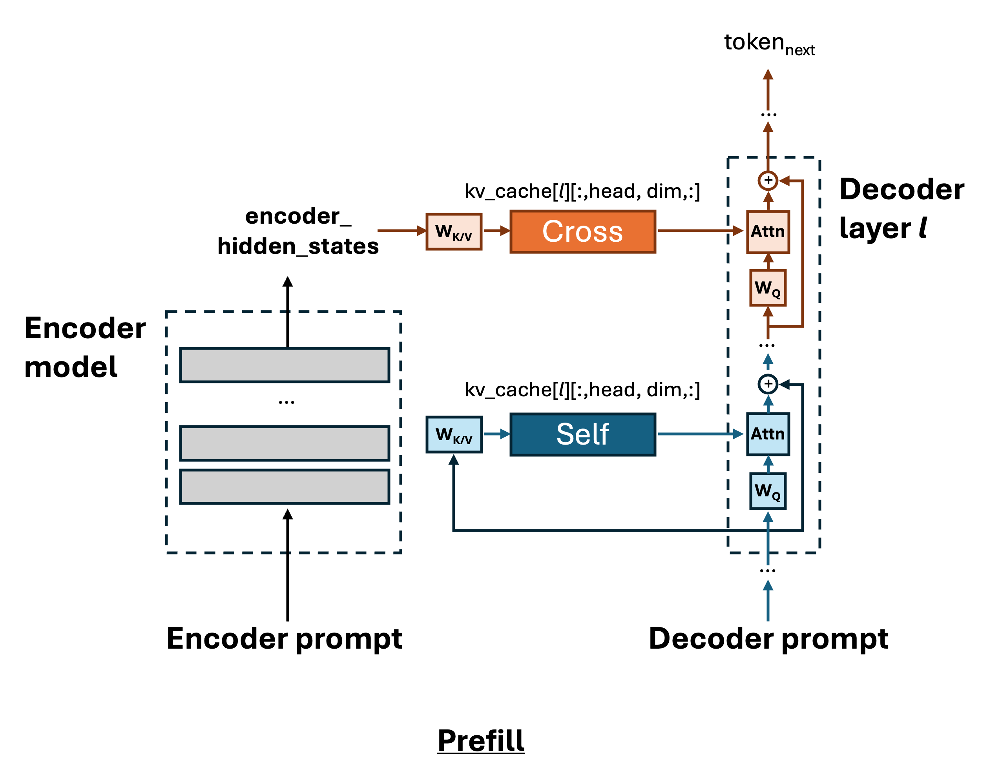
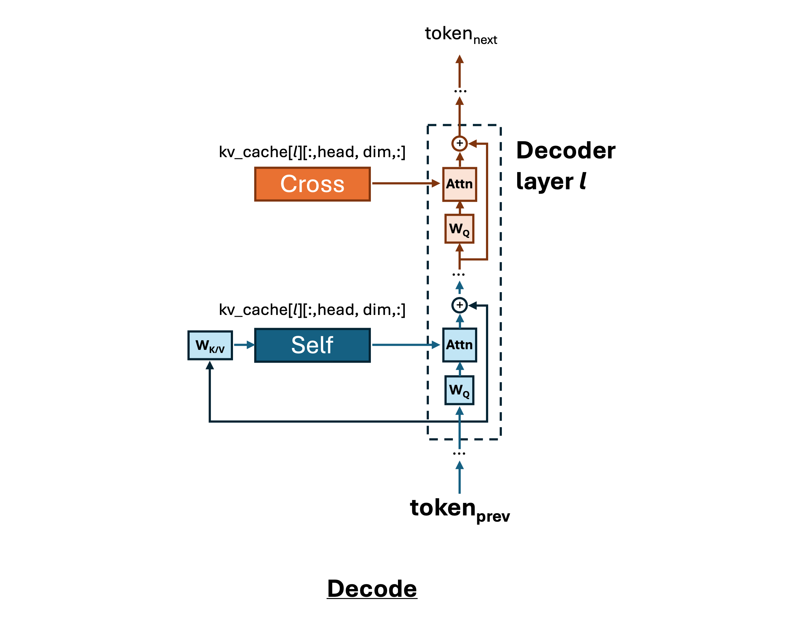
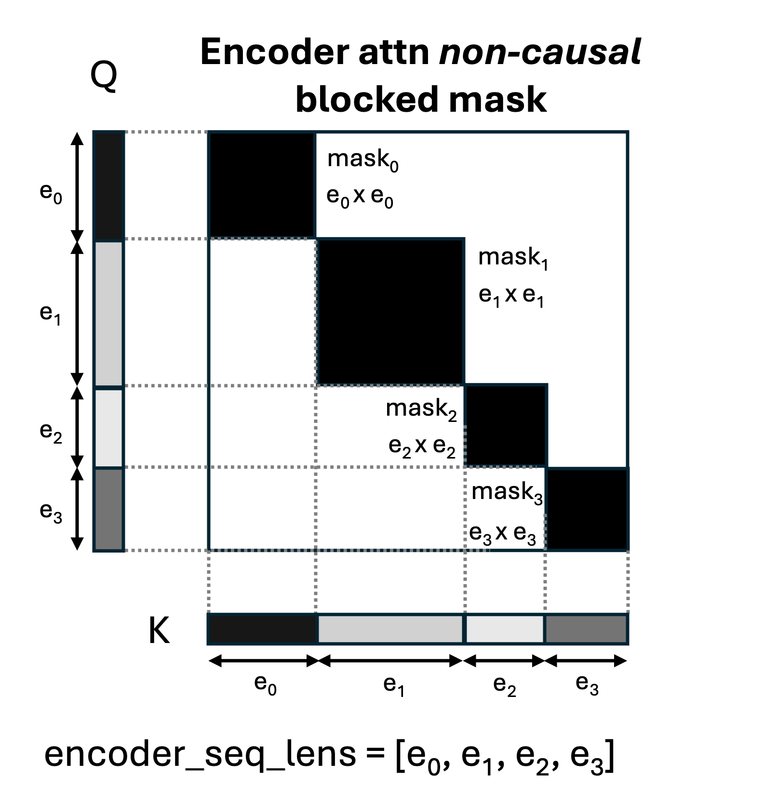
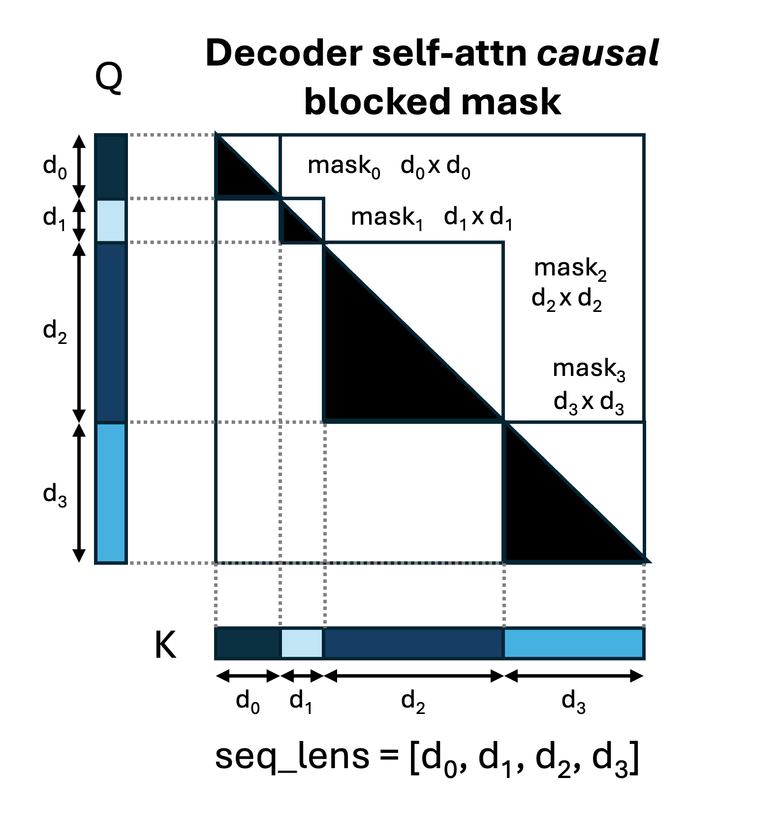
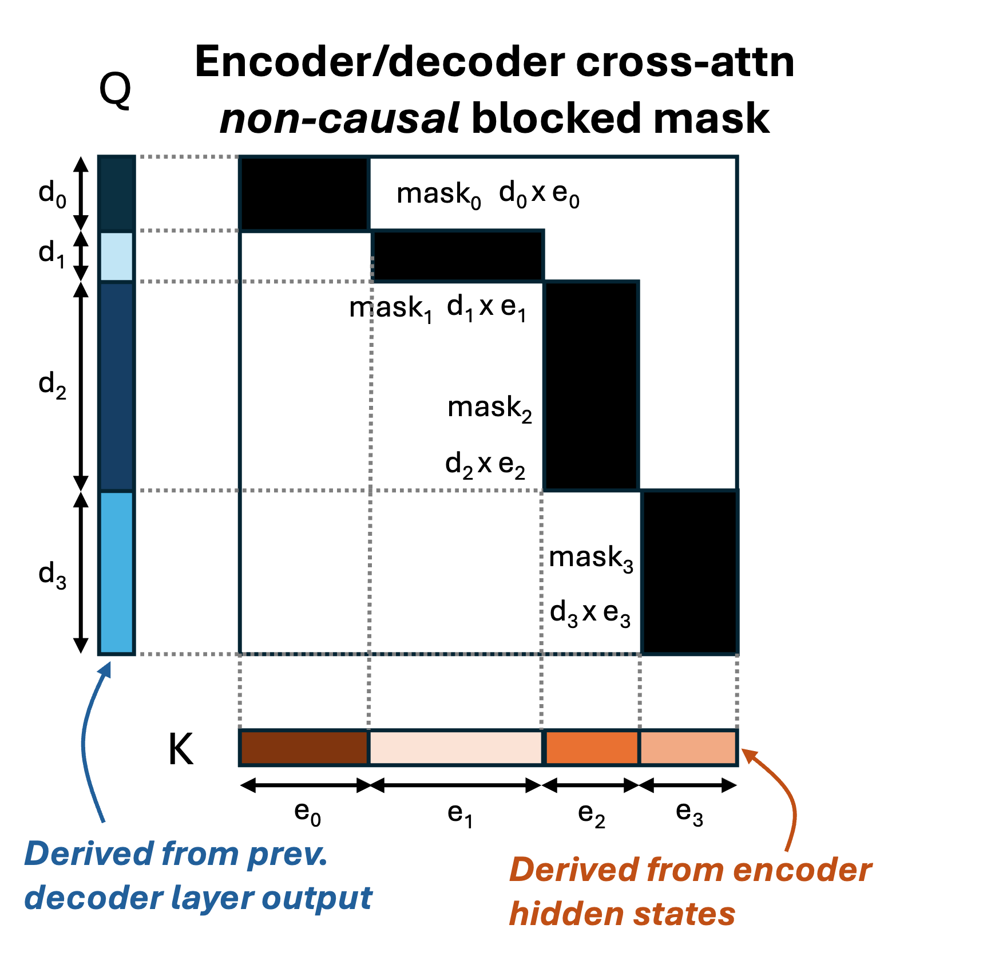

# vLLM encoder/decoder infrastructure overview

**Note:** use `Right-click > Open in new tab` to open links in this file

This document overviews the vLLM request-processing pipeline for encoder/decoder models, highlighting those aspects which differ from vLLM's decoder-only pipeline.

---

### *Encoder/decoder architecture diagram (prefill- and decode-phase)*

<figure>
  <p float="left">
    
    
  </p>
  <figcaption style="text-align: center; margin-top: 10px;">
    <small>
    <strong>Figure 1:</strong> Encoder/decoder architecture during the prefill <em>(left)</em> and decode <em>(right)</em> phases, omitting certain details such as layer norm. Encoder layers are abstracted as gray boxes, while decoder layers are blown-up to show how self-attention <em>(blue)</em> and cross-attention <em>(orange)</em> utilize KV caching. The KV caches shown are the decoder self-attn cache <em>(blue; "Self")</em> and the encoder/decoder cross-attn cache <em>(orange; "Cross")</em>. Although the model architecture does not change <em>per se</em> between the prefill and decode phases, nonetheless the encoder is omitted in the decode-phase diagram because all computations on the encoder hidden states are handled by the cross-attention KV cache, which is read-only during decode-phase. The decoder self-attention KV cache is updated with each new decoded token.
    </small>
  </figcaption>
</figure>

---

Figure 1, which reviews the generalized architecture of encoder/decoder models, clarifies why encoder/decoder models place additional requirements on the vLLM processing pipeline compared to decoder-only models:

* Both the encoder and decoder modules accept input prompts (Figure 1.) This means that, upon receiving a user request, vLLM must be able to either extract or infer both an encoder input prompt and a decoder input prompt.
    * At the other end, the request output - in order to be sensible to a human reader - must include the encoder & decoder input prompts as well as the decoded tokens.
* Once the encoder & decoder input prompts have been extracted, it must be possible to construct the usual vLLM intermediate representations such as `Sequence`, `SequenceGroup`, `SequenceGroupMetadata`, etc. Specifically, the encoder sequence - which is static after prefill - must be tracked alongside the decoder sequences, which are updated at each scheduler step.
* Figure 1 *(right)* shows that after prefill, it is possible to entirely discard the encoder output hidden states & make sole use of the cached cross-attention KVs to perform decode-phase cross-attention. This has significant implications for the request-processing pipeline:
    * In addition to the pre-existing vLLM "decoder self-attention" KV caches and associated block tables, the vLLM scheduler must now construct an "encoder/decoder cross-attention KV cache" and associated block table for each `SequenceGroupMetadata`.
    * The block manager - orchestrated by the scheduler - must correctly allocate, free and swap cross-attention KV cache.
    * The model runner must pass cross-attention block tables and slot mappings as input to models. The `AttentionMetadata` structure must include additional fields related to encoder sequences & cross-attention memory-mapping.
* Finally, the attention backends must support encoder attention, decoder self-attention, and encoder/decoder cross-attention. At time of writing only XFormers attention backend supports all of these capabilities.

The following sections will add more detail. It may be helpful to review [the official vLLM input process pipeline doc](https://docs.vllm.ai/en/latest/dev/input_processing/input_processing_pipeline.html#input-processing-pipeline) before continuing.

## 1. Issuing a request to vLLM

For decoder-only models, a vLLM request specifies a single text or tokens prompt, and possibly multimodal data.

An encoder/decoder model is architecturally capable of accepting two prompts, and currently vLLM does not support multimodal input for encoder/decoder models. So it would seem that vLLM requests should be able to pass in two prompts.

However, taking HF transformers as an example, it is also normal for encoder/decoder models to be invoked by passing in only a single prompt. In these cases, the input to `model.generate()` is typically passed to the encoder. The reason is that the encoder input is usually the "primary" input reflecting the purpose the model was designed for, whereas the decoder input - if specified by the user at all - is for tuning model behavior. For example:

* With HuggingFace (HF) BART, invoking `model.generate(prompt)` passes `prompt` to the encoder input, because the encoder encodes the question or document to summarize.
* With HF Whisper - a speech recognition model - preprocessed audio embeddings are passed to the encoder as input. The user rarely specifies a decoder prompt directly; instead the `WhisperConfig` determines translation language, timestamps, task, and other model behaviors. During inference Whisper effectively injects these settings into the decoder sequence as control tokens.

This suggests that when vLLM is running an encoder/decoder model, requests must *at minimum* always contain an encoder input prompt (or, in the future, multimodal data.)

However, it may be desirable for a user to be able to tweak the decoder prompt by injecting custom control tokens to tune model behavior. So it should also be possible for a request to specify a decoder prompt in addition to the encoder prompt.

### Supported encoder/decoder prompt formats

To that end, vLLM supports the following request formats for encoder/decoder models:

* Singleton prompt (implicitly an encoder prompt)

    * Singleton prompt string
        * vLLM will tokenize this prompt and pass the token-list to the encoder.
        * vLLM will pass a default prompt to the decoder.

        For example passing the singleton prompt below to vLLM BART

        ```
        "The rain in spain falls mainly on the"
        ```

        results in

        ```
        Encoder prompt: tokenize("The rain in spain falls mainly on the")
        Decoder prompt: [2,0] # <DEC><BOS>
        ```

        where `<DEC>` is decoder start token.

    * Singleton `TextPrompt`
        * vLLM will extract the prompt text, tokenize it and pass the token-list to the encoder.
        * vLLM will pass a default prompt to the decoder.

        For example passing the `TextPrompt` below to vLLM BART

        ```
        TextPrompt(
            'prompt': "The rain in spain falls mainly on the",
        )
        ```

        results in

        ```
        Encoder prompt: tokenize("The rain in spain falls mainly on the")
        Decoder prompt: [2,0] # <DEC><BOS>
        ```

        which is the same as for the raw text prompt; `TextPrompt` will only be differentiated from raw text prompts once multi-modal encoder/decoder support is added, at which point the `multi_modal_data` field of `TextPrompt` may be used.

    * Singleton `TokensPrompt` with prompt tokens
        * vLLM will pass the unmodified token-list directly to the encoder.
        * vLLM will pass a default prompt to the decoder.

        For example passing the `TokensPrompt` below to vLLM BART

        ```
        TokensPrompt(
            'prompt_tokens': [2,0,171,5,2]
        )
        ```

        results in

        ```
        Encoder prompt: [2,0,171,5,2]
        Decoder prompt: [2,0] # <DEC><BOS>
        ```

        Note that currently the `multi_modal_data` field of `TokensPrompt` may not be used.

* Explicit encoder/decoder prompt
    * Structure:

        ```
        ExplicitEncoderDecoderPrompt(
            'encoder_prompt': <Singleton prompt>,
            'decoder_prompt': <Singleton prompt>
        )
        ```

        * Each sub-prompt may be any of the aforementioned types of singleton prompt
        * vLLM will tokenize any sub-prompt which is not a token-list into a token-list
        * vLLM will preprocess the decoder prompt; the default behavior is to append a `<DEC>` token (ID=2 for BART tokenizer) to the beginning of the decoder token list, unless an initial `<DEC>` token is already present.
        * vLLM will pass the encoder prompt tokens to the encoder and the preprocessed decoder prompt tokens to the decoder

        For example passing the `ExplicitEncoderDecoderPrompt` below to BART

        ```
        ExplicitEncoderDecoderPrompt(
            'encoder_prompt': TextPrompt(
                                    'prompt': "The rain in spain falls mainly on the",
                                ),
            'decoder_prompt': [2, 0, 51, 178, 2]
        )
        ```

        results in

        ```
        Encoder prompt: tokenize("The rain in spain falls mainly on the")
        Decoder prompt: [2, 0, 51, 178, 2]
        ```

Additional notes on encoder/decoder prompts

* With regards to decoder prompt preprocessing, vLLM emulates the default behavior of HuggingFace transformers `GenerationMixin` for encoder/decoder models:
    * vLLM's default decoder prompt is `<DEC><BOS>` where `<DEC>` is decoder start token and `<BOS>` is beginning-of-sequence token. This is an approximation of of `GenerationMixin`'s default behavior when it receives a `None` decoder prompt, which is to (1) choose `<DEC>` as the default prompt, and (2) employ a logit processing constraint which forces the first decoded token to be `<BOS>`.
    * When the user specifies a decoder prompt that does *not* begin with `<DEC>`, `<DEC>` will be prepended to the prompt tokens during decoder prompt preprocessing. If the prompt tokens already begin with `<DEC>` then decoder prompt processing makes no change.
* However, if you are adding a new encoder/decoder model to vLLM you should consider whether vLLM's default decoder prompt & decoder prompt preprocessing logic need to be specialized for your model.

## vLLM internal data structures impacted by encoder/decoder support

* Upon receiving a request, `LLMEngine` processes the input prompt into an `EncoderDecoderLLMInput` instance

    ```
    class EncoderDecoderLLMInputs(LLMInputs):
        """
        The inputs in :class:`~vllm.LLMEngine` before they are
        passed to the model executor.

        This specifies the required data for encoder-decoder models.
        """
        encoder_prompt_token_ids: List[int]
        """The token IDs of the encoder prompt."""

        encoder_prompt: NotRequired[Optional[str]]
        """
        The original encoder prompt text corresponding to the token IDs, if
        available.
        """
    ```

    Note that in addition to the encoder-oriented fields shown above, `EncoderDecoderLLMInputs` also retains the decoder-oriented `prompt` and `prompt_token_ids` fields defined for `LLMInputs`.

* vLLM allows a `Sequence` to be constructed from an `LLMInputs` instance, via the `inputs` constructor argument. Thus it is also possible to construct a `Sequence` from an `EncoderDecoderLLMInputs` instance. 
  * The `Sequence` constructor has a `from_decoder_prompt` argument:
    * `from_decoder_prompt=True` will construct the sequence from `inputs.prompt_token_ids` and `inputs.prompt`
    * `from_decoder_prompt=False` will construct the sequence from `inputs.encoder_prompt_token_ids` and `inputs.encoder_prompt`

* `SequenceGroup` represents all sequences associated with a single request. Now `SequenceGroup` has an additional `encoder_seq` member, which allows it to represent the encoder input sequence associated with a request.

* `SequenceGroupMetadata` encapsulates metadata - including but not limited to sequence data & block tables - associated with a given request in a given inference step. Now `SequenceGroupMetadata` has additional `encoder_seq_data` and `cross_block_table` fields for representing encoder input sequence data and encoder/decoder cross-attention block table, respectively.
  * `SequenceGroupMetadata.block_table` is a `Dict[int,List[int]]` because the sequence group contains a self-attention block table for each each decoder sequence; each decoder sequence has an integer ID which is used to look up its block table.
  * `SequenceGroupMetadata.cross_block_table` is an `Optional[List[int]]` because there is maximum one cross-attention block table per sequence group (the decoder-only pipeline employs no cross-attention block tables)

## Memory management

### How block space manager v1 manages GPU and CPU memory for encoder/decoder models

(For brevity, the impact of encoder/decoder on block space manager v2 is omitted here.)

#### Internal block table representations

The block manager contains two internal block table representations
* `block_tables: Dict[int, BlockTable]`: a *decoder `Sequence` ID -> self-attention block table* mapping
* `cross_block_tables: Dict[str, BlockTable]`: a *`SequenceGroup` request ID -> cross-attention block table* mapping
  * Rationale: as described earlier there is max one cross-attention block-table per `SequenceGroup`, therefore `SequenceGroup` request IDs are sufficient for identifying cross-attention block-tables
  * Note: (1) `SequenceGroup` IDs are globally-unique in vLLM (2) `SequenceGroup` request IDs are strings
  * For decoder-only models, `cross_block_tables` will be an empty dictionary

`block_man.get_block_table(seq)` returns the self-attention block-table associated with the `Sequence` in the argument.

`block_man.get_cross_block_table(seq_group)` returns the cross-attention block-table associated with the `SequenceGroup` in the argument.

#### Allocate

* The block manager is managing $total\_num\_gpu\_blocks$ GPU memory blocks and $total\_num\_cpu\_blocks$ CPU memory blocks
* `block_man.allocate(seq_group)` provisions:
  * One self-attention KV cache for each decoder sequence in the `SequenceGroup`
  * One KV cache for cross-attention, with the number of token slots equal to the length of the `SequenceGroup`'s encoder sequence.
  * Allocation yields a block table for the cross-attention KV cache & one block table for each self-attention KV cache
  * **Total # of blocks:**

    $$ (seq\; group\; blocks) = |cross\; attn\; blocktable| + \sum_{i}^{num\; seqs}{|seq_{i}\; decoder\; self\; attn\; block\; table|} $$
  * After allocation,

    $$ (free\; gpu\; blocks\; after\; alloc) = (free\; gpu\; blocks) - (seq\; group\; blocks) $$

#### Swap

* `block_man.swap_out(seq_group)` accomplishes GPU -> CPU swap for a `SequenceGroup`'s KV caches.
  * After swap,

    $$(free\; gpu\; blocks\; after\; swap\; out) = (free\; gpu\; blocks) + (seq\; group\; blocks)$$
    $$(free\; cpu\; blocks\; after\; swap\; out) = (free\; cpu\; blocks) - (seq\; group\; blocks)$$

* `block_man.swap_in(seq_group)` accomplishes CPU -> GPU swap for a `SequenceGroup`'s KV caches.
  * After swap,

    $$(free\; gpu\; blocks\; after\; swap\; in) = (free\; gpu\; blocks) - (seq\; group\; blocks)$$
    $$(free\; cpu\; blocks\; after\; swap\; in) = (free\; cpu\; blocks) + (seq\; group\; blocks)$$

#### Free

* `block_man.free(seq)` frees the self-attention KV cache blocks associated with the `Sequence` argument passed in.
  * After `free()`,
  
    $$ free\; device\; blocks\; after\; free = free\; device\; blocks\ + |seq_{i}\; decoder\; self\; attn\; block\; table| $$

    where $device$ is whichever of $\{CPU,GPU\}$ the `SequenceGroup` currently resides in, and $i$ is the `Sequence` id

* `block_man.free_cross(seq_group)` frees the cross-attention KV cache blocks associated with the `SequenceGroup` argument passed in.
  * After `free_cross()`,

    $$ free\; device\; blocks\; after\; free\_cross = free\; device\; blocks\ + |cross\; attn\; blocktable| $$

    where $device$ is whichever of $\{CPU,GPU\}$ the `SequenceGroup` currently resides in.

#### Reset

* `block_man.reset()` frees all cache blocks associated with all block tables managed by the block manager, after which there are $total\_num\_gpu\_blocks$ free GPU memory blocks and $total\_num\_cpu\_blocks$ free CPU memory blocks

## Scheduler modifications

* For encoder/decoder models only,
  * `Scheduler.schedule()` now has the added behavior of passing `encoder_seq_data` and `cross_block_table` to the `SequenceGroupMetadata` constructor
    * `Scheduler.scheduler()` obtains `encoder_seq_data` from `SequenceGroup.encoder_seq`  and `cross_block_table` from `block_man.get_cross_block_table(seq_group)`

  * `Scheduler.abort_seq_group(req_id)` now has the added effect of freeing the cross-attention block-table associated with the `SequenceGroup` with request ID `req_id`
    * `Scheduler._free_seq_group_cross_attn_blocks(seq_group)` is the helper function which frees the cross-attention block-table

  * `Scheduler.free_finished_seq_groups()` now has the added effect of invoking `Scheduler._free_seq_group_cross_attn_blocks(seq_group)` against all *finished* `SequenceGroup`s, which frees the `SequenceGroup` cross-attention block tables.
    * `Scheduler.free_finished_seq_groups()` is invoked by `LLMEngine._process_model_outputs()`

## ModelRunner modifications

Generally speaking, `ModelRunner` and its subclasses consume the `SequenceGroupMetadata` instances constructed by the `Scheduler`. 

For decoder-only models, `ModelRunner` utilizes these `SequenceGroupMetadata` instances to:
* Construct the decoder input tokens/positions
* Build the decoder self-attention slot-mappings data structure
* Compute the decoder sequence lengths, token-counts, etc.
* Construct an `AttentionMetadata` instance

For encoder/decoder models, `EncoderDecoderModelRunner` prepares all of the same decoder-oriented model inputs, but additionally constructs:
* The encoder input tokens/positions
* The encoder/decoder cross-attention slot-mappings data structure
* The encoder sequence lengths, token-counts, etc.

## Model `forward()` arguments & model architecture

See the how-to guides for [encoder/decoder model `forward()` method arguments](https://github.com/afeldman-nm/vllm-enc-dec-rfc/blob/main/how-to.md#2-rewrite-the-forward-methods) and [suggested encoder/decoder model architecture](https://github.com/afeldman-nm/vllm-enc-dec-rfc/blob/main/how-to.md#25-optional-but-strongly-recommended-implement-the-following-encoderdecoder-model-architecture).

## Attention backend modifications

### Default encoder/decoder attention bias (or mask)

Two factors which complicate scaled dot-product (SDP) attention computation in the vLLM backend are:

1. For an $N$-sequence batch, vLLM passes the model a single token vector which is the concatenation of the $N$ sequences (without padding), and which has a total number of tokens equal to the sum of the token-counts of all $N$ sequences. vLLM expects the model to pass tokens to the `Attention` layer in this single-vector format, which means all sequences are handled in a single SDP attention computation. But critically **the sequences must attend only to themselves and not each other during the `Attention` layer computation.** This effectively requires discarding parts of the SDP attention score matrix corresponding to attention between sequences.

2. **(Encoder/decoder only)** By default (i.e. unless a particular model specifies otherwise), non-causal attention is employed for encoder attention & encoder/decoder cross-attention, while causal attention is employed for decoder self-attention.

vLLM addresses both requirements by augmenting SDP attention with a *causal* or *non-causal block-diagonal attention mask*. The SDP attention computation may be augmented with a *bias* or *mask* matrix $A$:

$$
attn(Q,K,V,A) = softmax(\frac{Q K^T + A}{\sqrt{d}})V
$$

The SDP attention score computation $Q K^T$ yields an attention score matrix; the white regions outside of the diagonal blocks in Figure 2 reflect the portions of the attention score matrix corresponding to inter-sequence attention (which is we would like to omit from computation), while the diagonal blocks correspond to within- or intra-sequence attention (which belongs in the computation.) A block-diagonal attention mask $A$ prevents inter-sequence attention, provided that it is always equal to $-\infty$ in the inter-sequence regions of the SDP attention score matrix, as shown in Figure 2.


---
### *vLLM attention backend: block-diagonal masks for encoder, decoder self-, and encoder/decoder cross-attention*

<figure>
  <div style="display: flex; justify-content: space-between; align-items: center;">
    
    
    
  </div>
  <figcaption style="text-align: center; margin-top: 10px;">
  <small>
    <strong>Figure 2:</strong> Block-diagonal attention masks employed in the vLLM backend. Black regions correspond to intra-sequence attention in the SDP attention score matrix and would equal <em>0</em> in the attention mask. White regions correspond to inter-sequence attention in the SDP attention score matrix and would equal <em>-inf</em> in the attention mask. Left</em>: non-causal encoder attention for <em>N=4</em> concatenated sequences each with length <em>e_i</em> for <em>i</em> in <em>[0,N)</em>. <em>Middle</em>: causal decoder self-attention for <em>N=4</em> concatenated sequences each with length <em>d_i</em> for <em>i in [0,N)</em>. <em>Right</em>: non-causal encoder/decoder cross-attention between <em>N=4</em> decoder sequences each with length <em>d_i</em> for <em>i</em> in <em>[0,N)</em> and <em>N=4</em> encoder sequences each with length <em>e_i</em> for <em>i</em> in <em>[0,N)</em>.
    </small>
  </figcaption>
</figure>

---

The $i$-th block in the block-diagonal mask corresponds to the $i$-th sequence's attention matrix. For decoder self-attention, the default is for each block along the diagonal of the decoder self-attention mask to be causal ($0$ in the lower-triangle and $-\infty$ above (Figure 2, *middle*).) For encoder and encoder/decoder cross-attention, the default is for each diagonal block in the attention mask to be non-causal (entirely $0$ (Figure 2, *left* and *right*).)

Note the rectangular shape of the diagonal blocks in the cross-attention mask, as compared to the square blocks in the encoder and decoder self-attention masks. In encoder attention and decoder self-attention, Q and K are derived from the same source (previous encoder or decoder layer output, respectively) and thus have the same length; therefore, the regions of the SDP attention score matrix corresponding to intra-sequence attention will always be square. In contrast, cross-attention Q is derived from the decoder self-attention hidden state output while K is derived from the encoder hidden states. Since the encoder and decoder have different input prompts, Q and K may differ in length for cross-attention, which is why the diagonal blocks are rectangular.

### Attention mask implementation considerations

Currently, vLLM does not support passing *arbitrary fully-materialized* $A$ matrices into the attention backends (this is the focus of the [custom attention bias](https://github.com/vllm-project/vllm/issues/7366#support-custom-attention-bias) workstream); instead the attention mask is represented in a compact & non-materialized fashion.

More specifically, the vLLM XFormers attention backend internally constructs instances of `BlockDiagonalMask` or `BlockDiagonalCausalMask` and passes them to the XFormers kernels. `BlockDiagonalMask` is utilized when `Attention.forward()` is invoked with `attn_type=AttentionType.ENCODER` or `attn_type=AttentionType.ENCODER_DECODER`. `BlockDiagonalCausalMask` is utilized when `Attention.forward()` is invoked with `attn_type=AttentionType.DECODER`.

The vLLM flash-attention backend does not currently support encoder attention or encoder/decoder cross-attention; however, a logical approach would be to configure block-diagonal mask shape using `FlashAttentionMetadata.query_start_loc` and `FlashAttentionMetadata.seq_start_loc`, and causality using the flash-attention kernel's `causal=True/False` flag.

The vLLM Flashinfer backend also does not currently support encoder attention or encoder/decoder cross-attention; however a similar approach based on `query_start_loc`/`seq_start_loc`/`causal` flag should work

Note that adding encoder/decoder support to backends other than XFormers is [a workstream in the encoder/decoder RFC](https://github.com/vllm-project/vllm/issues/7366#add-support-for-encoder-attention-and-cross-attention-to-additional-backends).

[^1]: [Whisper](https://cdn.openai.com/papers/whisper.pdf) is a multi-modal encoder/decoder speech-recognition model.